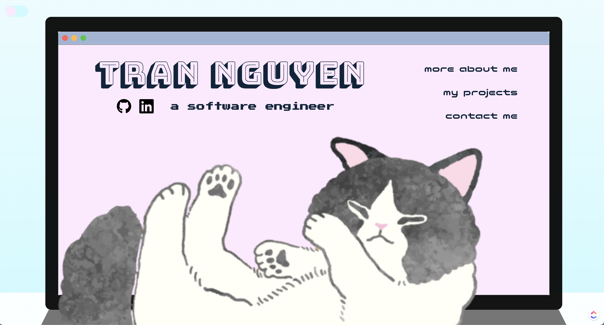

# Personal Portfolio

Hi there 👋! This repo contains the source code for my personal portfolio website as well as the planning materials. Feel free to download the designs here or to fork this project and use it as inspiration for your own portfolio website!

### Motivation

This project is meant to provide a little more information about me and share some of the things that I've worked on and currently working on.

## [Check it out!](https://iamtran.netlify.app/)

### Screenshots

### Technologies Used

## [Trello planning materials](https://trello.com/b/hdbCUibc/personal-portfolio)

### Attributions

### Next Steps

### Contact
If you have any questions or suggestions, feel free to contact me at tranhnnguyen13@gmail.com.